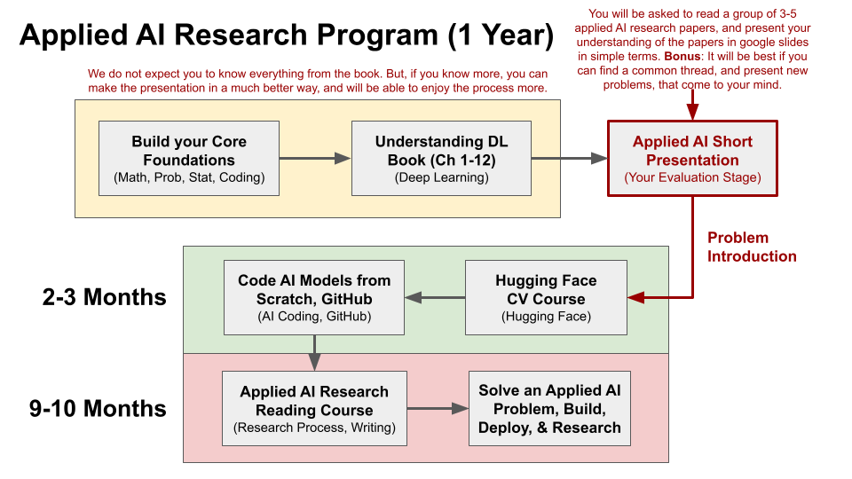

# Medical Imaging AI Research Program (Level 1)

  

# **Research Group Framework**

## **Goals and Expectations**
### **1. Active Participation**
- Group members are expected to ask questions regularly about **learning**, **building**, and **researching AI** in the medical field.
- Engagement is key for collaboration and growth.

### **2. Mutual Responsibilities**
- **My Duty**: Organize sessions, share research ideas, and address doubts within my knowledge domain.
- **Your Duty**: Actively ask questions, share progress, and participate in discussions.

### **3. Membership Size**
- Initially, the group will remain **small and focused**.
- If it grows beyond capacity, a **core focused group** will be created to maintain quality interactions.

---

## **Step-by-Step Process for Engagement**

### **Step 1: Identify Your Learning Phase**
- Categorize yourself into one of these stages:
  - **Yellow Zone**: Beginner-level understanding.
  - **Green Zone**: Intermediate skills.
  - **Red Zone**: Advanced, ready for hands-on implementation and evaluation.

### **Step 2: Ask Questions Based on Your Phase**
- Raise doubts and seek guidance on:
  - How to learn effectively at your stage.
  - Resources to use for improving your knowledge.

### **Step 3: Use Recommended Resources for Learning**
- **Books**: Start with *Understanding Deep Learning* ([UDL Book](https://udlbook.github.io/udlbook/)) to build foundational knowledge.
- **Online Tools**: Use AI assistants like **ChatGPT** or **Google LM Notebook** for quick queries and learning.

### **Step 4: Attend Live Research Sessions**
- Participate in **monthly, biweekly, or weekly sessions** where new research ideas and topics are presented.
- Ask questions actively during these sessions to deepen understanding.

### **Step 5: Evaluation Readiness**
- After discussions and consistent participation, you and I will assess your readiness for an **evaluation phase** to gauge progress.

### **Step 6: Core Learning Activities**
- Independent learning is crucial:
  - **Learn Hugging Face's Computer Vision (CV) Course** ([Hugging Face CV Course](https://huggingface.co/learn)).
  - **Build AI Models** by reading GitHub repositories and implementing projects from scratch.

### **Step 7: Tackle the Red Zone**
- Use the live sessions to gain insights and tackle challenges in the **Red Zone** phase of learning.

---

## **How I Will Contribute**
1. Share Medical AI research posts and links to keep the group engaged.
2. Present and discuss new research ideas in the live sessions.
3. Provide support to clear doubts within my expertise.

---

## **Summary**
This is a collaborative program that relies on **active participation and mutual effort**. I will fulfill my responsibilities, but it’s up to each member to stay engaged, ask questions, and contribute to the group’s growth.

Let’s aim to build an informed, motivated, and collaborative community of Medical AI enthusiasts!
