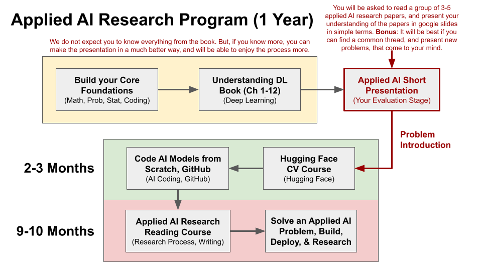

# Medical Imaging AI Research Program (1 year)

Watch this video. I have discussed [the program in detail](https://youtu.be/dQNGmBTTAWk?si=VK11r9uJcNcWBZHP). This program is designed to guide participants through a structured process for learning and contributing to applied AI research, specifically focusing on foundational skills, hands-on projects, and research activities. This research program is inspired by the process of my research journey over time. I have described a part of my research journey in detail [in my newsletter](https://mukherjeesrijit.substack.com/p/25-years-notes-of-my-applied-ai-research). The timeline and steps are outlined below:

---

  

## **Phase 1: Build Your Core Foundations** (0-2 Months)
### **Goals**
- Develop a strong foundation in essential topics:
  - Mathematics
  - Probability
  - Statistics
  - Programming (e.g., Python)

### **Tasks**
1. Strengthen your understanding of fundamental mathematical concepts used in AI.
2. Learn and practice programming, focusing on problem-solving and algorithm implementation.

---

## **Phase 2: Deep Learning Foundations** (2-3 Months)
### **Goals**
- Gain a thorough understanding of deep learning concepts and architectures.
- Complete the **Deep Learning Book** (Chapters 1-12).

### **Tasks**
1. Read and understand the topics covered in each chapter.
2. Implement simple deep learning models to practice concepts.

---

## **Phase 3: Applied AI Short Presentation** (Your Evaluation Stage)
### **Goals**
- Apply your knowledge by reading research papers and presenting insights.

### **Tasks**
1. Read a group of 3-5 applied AI research papers.
2. Create a Google Slides presentation summarizing your understanding in simple terms.
3. Focus on identifying a common thread among the papers and propose potential new problems.
4. **Bonus**: Present new ideas or challenges inspired by your reading.

---

## **Phase 4: Hands-On AI Model Development** (2-3 Months)
### **Goals**
- Build practical coding skills by creating AI models from scratch.

### **Tasks**
1. Explore and practice AI coding through GitHub repositories.
2. Write your own implementations of standard AI models.
3. Take the **Hugging Face Computer Vision Course** to enhance your knowledge of state-of-the-art techniques.

---

## **Phase 5: Research Reading Course** (9-10 Months)
### **Goals**
- Develop a deeper understanding of applied AI research.
- Learn to navigate the research process and improve scientific writing skills.

### **Tasks**
1. Engage in structured reading of advanced AI research papers.
2. Analyze methodologies, results, and their applications.
3. Practice summarizing research findings clearly and concisely.

---

## **Phase 6: Solve an Applied AI Problem** (9-10 Months)
### **Goals**
- Solve a real-world AI problem and contribute to applied research.

### **Tasks**
1. Select a specific applied AI problem in your area of interest.
2. Build, deploy, and evaluate an AI solution for the chosen problem.
3. Document your findings and share your results through research papers or presentations.

---

## **Key Notes**
- **Presentation Quality Matters**: Your presentation and understanding of research papers will be evaluated. While the expectation isn't to know everything, a deeper understanding will enable better presentations and a more enjoyable process.
- **Creativity is Encouraged**: Use the knowledge gained to identify gaps in research and propose innovative solutions.

---

## **Suggested Tools and Resources**
- Programming: Python (TensorFlow, PyTorch, Hugging Face)
- Learning Resources: Deep Learning Book, Hugging Face Courses, GitHub repositories
- Research Tools: Google Scholar, arXiv
- Presentation: Google Slides or equivalent

---

## **Final Objective**
By the end of this program, participants will:
1. Have a strong foundation in AI and deep learning.
2. Gain experience in implementing AI models and analyzing research.
3. Solve a real-world problem and contribute meaningfully to the field of applied AI research.
