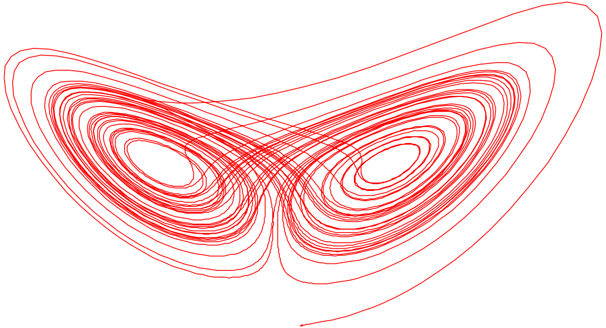
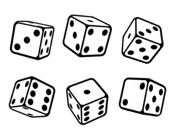
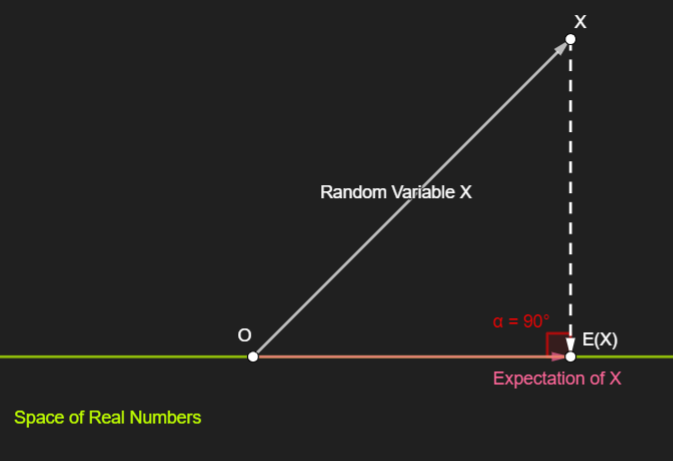
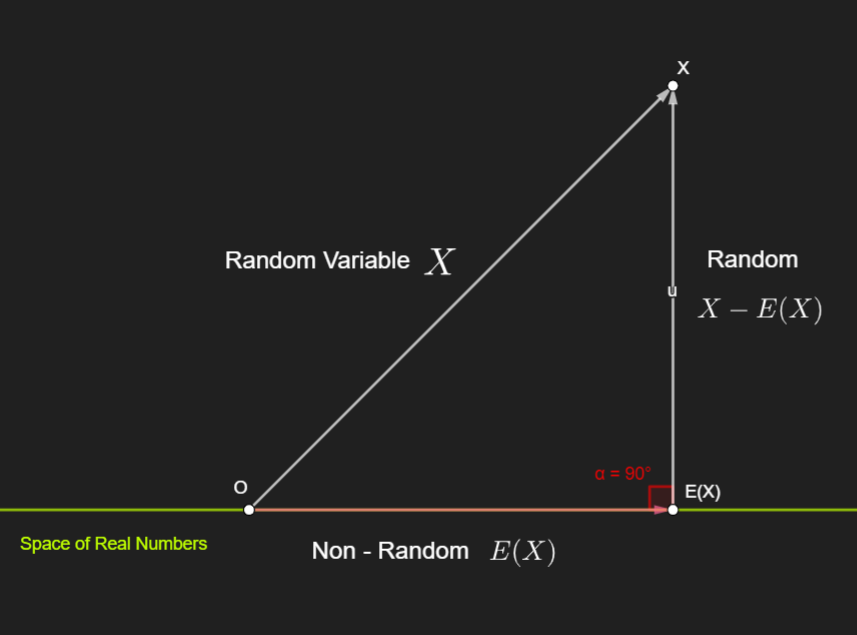
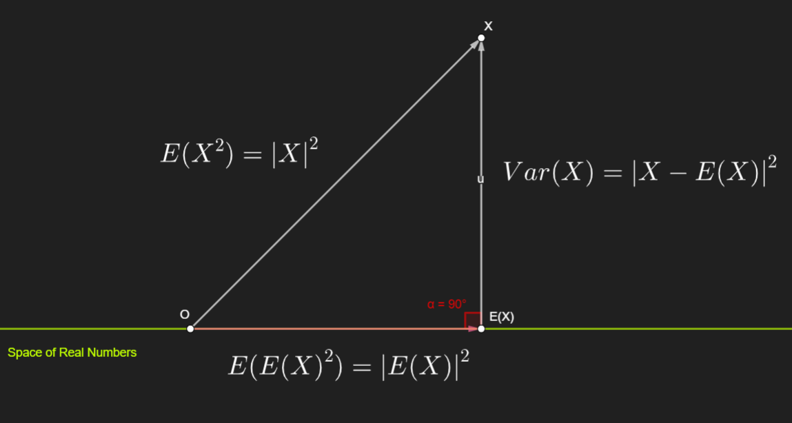
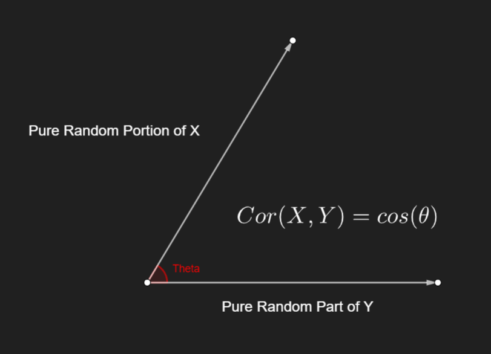
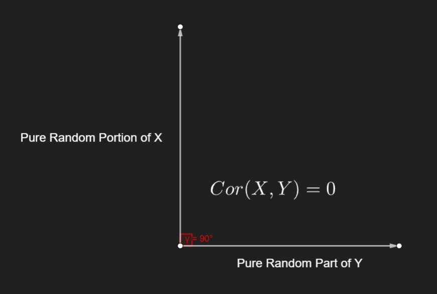
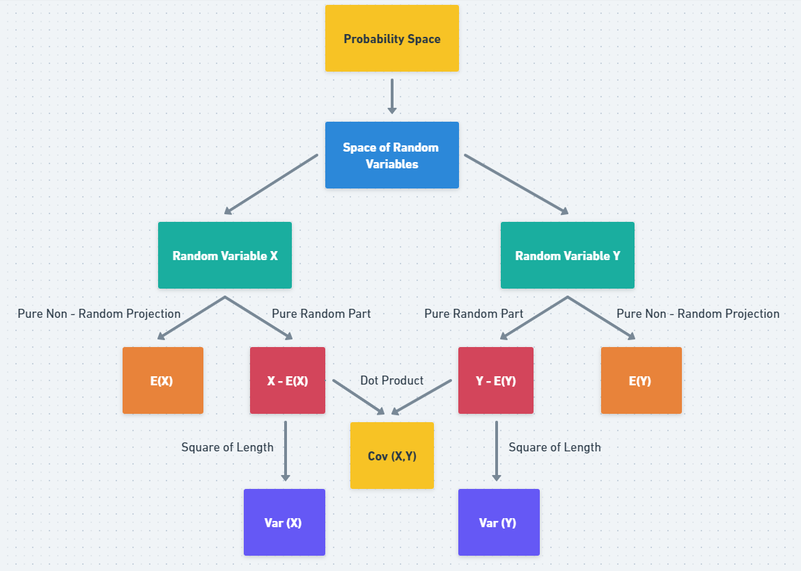

# The Exotic Geometry of Randomness

**Srijit Mukherjee**  
* Pennsylvania State University (Ph.D. (Ongoing)) 
* Indian Statistical Institute (BStat (2019), M.Stat (2021))

## We love chaos. Don't we?

> "The butterfly that flutters its wings and causes a hurricane on the other side of the world." Sound familiar? Are you that butterfly, Martin?

This quote from the film [The Oxford Murders](https://www.imdb.com/title/tt0488604/) tells us how much we fathom chaos. Through the ages, human beings have tried to decipher and bring order to chaos. One such attempt was the discovery of the Lorentz Attractor, which looks like a butterfly's wings, as shown below. You can read more about it [here](https://en.wikipedia.org/wiki/Lorenz_system).

    

As Henry Adams has said, "Chaos is the law of nature, and Order: the dream of human". When I was scrolling through the pages of the book *Chaos: Making a New Science*, a question popped into my mind this morning "What do random things look like?".

What can be better than rolling dice to start the journey? Take a dice in your hand. Roll it.

     

You have six (6) possible outcomes {1, 2, 3, 4, 5, 6} from this experiment of rolling the dice. From your past experiences of 100 rolls of the dice, you got the following table of data.

    
| Outcome | Times of Occurrence |
| :---:   | :---:              |
|    1    |        20           |
|    2    |        20           |
|    3    |        10           |
|    4    |        15           |
|    5    |        25           |
|    6    |        10           |

Since you don't know the outcome, you attach numbers to it, based on the data. The numbers tell you the chances of the outcomes like this.

    
| Outcome | Times of Occurrence |
| :---:   | :---:              |
|    1    |        0.20           |
|    2    |        0.20           |
|    3    |        0.10           |
|    4    |        0.15           |
|    5    |        0.25           |
|    6    |        0.10           |

Now, rolling the dice once, you can gamble with your friend. The rules of the game are as follows:

* You get Rs 100 for getting prime numbers in a dice throw.
* You will be fined Rs 130 otherwise.

You can now, re-write the table differently by accommodating your gambling game persona.

| Outcome | Gain | Chance / Probability |
| :---: | :---: | :---: |
| 1 | -130 | 0.2 |
| 2 | 100 | 0.2 |
| 3 | 100 | 0.1 |
| 4 | -130 | 0.15 |
| 5 | 100 | 0.25 |
| 6 | -130 | 0.1 |

Note that the Gain variable is a "Random" thing, called a "Random" variable in probabilistic language. A Random Variable is technically defined as a function that maps the elements of the Outcome Space to the Set of Real Numbers. Gain is a function from Outcome Space $\rightarrow$ Real Numbers. The Outcome Space = {1, 2, 3, 4, 5, 6}. The Gain Random Variable is defined as follows.

$$
\text{Gain}(x) = 
\begin{cases}
    100 & \text{if } x \text{ is prime} \\
    -130 & \text{if } x \text{ is not prime}
\end{cases}
$$

Next year, the gambling game rules may change, and hence the random variable too. So, you can imagine that there can be so many random variables based on the same experiment. There is a nice way of sewing all these ideas together using some artistic mathematical symbols. Let me share that with you, with the help of probability. Three dimensions make the Probability Space $(\Omega, \mathcal{F}, \mathbb{P})$:

* The Outcome Space $=\Omega$
* The Event Space $=\mathcal{F}$
* The Probability $=\mathbb{P}$

The Outcome Space is the set of all possible outcomes of the experiment. In the example above, you have {1, 2, 3, 4, 5, 6}

The Event Space is the set of possible events to which we can assign a probability. In the example above, you can post a probability to any subset of the Outcome Space {1, 2, 3, 4, 5, 6}, say you can assign a probability to the set of all prime numbers in the outcomes {2, 3, 5}.

The Probability is assigned to each event using the conservation laws of probability like the conservation laws of energy. One way is to say that probability never gets destroyed or created. Now, based on this setup, you take the set of all possible random variables you can define on this probability space. Let's give it a symbol. 

* The Random Variable Space $=\mathscr{V}$

So, we now have the four dimensions to our understanding: the Outcome Space, the Event Space, the Probability, and the Random Variable Space.

$$
(\Omega, \mathcal{F}, \mathbb{P}, \mathscr{V})
$$

I will not give a spoiler but these random variables together have an exotic geometric structure. Let's say you have two random variables $X$, and $Y$. You can gain insights from certain transformations.

* You can stretch one to get a new random variable: $c \times X$ is a random variable.
* You can add them to get another random variable: $X+Y$ is a random variable.
* You can find the dot (inner) product between two random variables by their expected product: $E(X Y)=$ Dot Product of $X$ and $Y$
* You can measure the length of the random variable by its expected square. $E(X X)=E\left(X^2\right)=\text { Length }^2 \text { of } X$ 

Yes, it's that beautiful!

In other words, a random variable is a vector. In technical terms, the space of random variables forms a vector space (more specifically inner product space). Let's see what we can discover from this exotic geometric setup of the space of random variables. However, some natural questions may arise. We will take each piece of the puzzle, and try to discover it in full depth. We will answer these questions one by one.

## Questions

### Why is the expected product, the dot product of two random variables?

Let's try to map the matching of the properties of both ideas.

* Symmetry

$$
\begin{aligned}
\vec{x} \cdot \vec{y} & =\vec{y} \cdot \vec{x} \\
E(X Y) & =E(Y X)
\end{aligned}
$$

* Linearity

$$
\begin{gathered}
(a \vec{x}+b \vec{y}) \cdot \vec{z}=a(\vec{x} \cdot \vec{z})+b(\vec{y} \cdot \vec{z}) \\
E((a X+b Y) Z)=a E(X Z)+b E(Y Z)
\end{gathered}
$$

* Positiveness

$$
\begin{aligned}
\vec{x} \cdot \vec{x} & =|\vec{x}|^2 \geq 0 \\
E(X X) & =E\left(X^2\right) \geq 0
\end{aligned}
$$

In other words, the expected product of two random variables has precisely all the core properties of the dot product, and hence all the ideas and results, and the geometry of dot products will be valid. We will explore them soon. For easier understanding let's define the following.

$$
\begin{gathered}
E(X Y)=X \odot Y \\
E\left(X^2\right)=|X|^2
\end{gathered}
$$

* The Space generated by a single Random Variable

Let's say you have a random variable $X$. Consider the following simple set of random variables: $X$, and all the scaled versions of $X$. You can imagine it as a line in the space containing the vector $X$.

$$
k \times X \mid k \in \mathbb{R}
$$

You can show this is a vector space in itself. You will see that we need it. Now, the next natural question is?

### Is a real constant a random variable?

Yes, it is. Just like Newton's laws of motion for point objects is valid for macroscopic objects, similarly, a real constant is a random variable, with zero randomnesses. So, the set of Real Numbers is also a vector space, with zero randomnesses. You can write it like this.

$$
k \times 1 \mid k \in \mathbb{R}
$$

You will see this has a beautiful connection with the expectation of a random variable. Now, it is time to talk about the exotic geometries. First, to talk about geometry, the natural question is, can we define a distance between two random variables?

* Distance between two random variables

We have seen that the expected square of a random variable is like the square of the length of the random variable. Similarly, we can define the distance $D$ between two random variables, just like we can define the distance $D$ between two vectors. Let's see the connection. 

$$
\begin{gathered}
D^2(\vec{x}, \vec{y})=|\vec{x}-\vec{y}|^2 \\
D^2(X, Y)=|X-Y|^2=E\left((X-Y)^2\right)
\end{gathered}
$$

## The Exotic Geometry of Expectation

There is a famous result, which is very central to a probability course. If you have a random variable, $X$, then for which value of $c$, the following quantity is minimized $E(X-c)^2$?

Observe that is asking nothing but for which random variable in the space of real numbers, $k \times 1 \mid k \in \mathbb{R}$ the distance between $X$ and that real constant random variable $D^2(X, c)=|X-c|^2=E\left((X-c)^2\right)$ is minimized.

We can easily show by calculus that the value is minimized at $c$ = the expected value of $X$. In other words, the expectation of a random value is the value in the real numbers, which is closest to the random variable $X$.

    <kbd>  </kbd>

Observe that the distance is minimized for the perpendicular projection. Hence, the expectation of a random variable $X$ is nothing but the projection of the random variable $X$ on the space of constant real numbers. In another sense, the best real constant that can best approximate a random thing $X$ is its expected value. Also, note that if you take a different distance, the constant will change. Exotic, right?

## The Exotic Geometry of Variance

As they say variance of random variable measures the amount of randomness. The lesser the variance, the lesser the randomness. Let's visualize the variance. Let's understand a random variable $X$ first. 

$$
X=E(X)+(X-E(X))
$$

The Expectation is nothing but a non-random quantity. It is the closest non-random quantity that can approximate $X$, the best. Hence, the rest of the part is the pure random thing corresponding to the random variable $X$.

$$
\begin{gathered}
X=\text { Random Variable } \\
E(X)=\text { Non-Random Part of } X \\
X-E(X)=\text { Pure Random Part of } X
\end{gathered}
$$

You can visualize it in the following way.

    <kbd>  </kbd>

Variance is nothing but the square of the length of the pure random part of $X$.

$$
\begin{gathered}
\text{Var}(X)=|X-E(X)|^2 \\
\text{Var}(X)=E\left((X-E(X))^2\right)
\end{gathered}
$$

Let's see just the Pythagoras theorem at play.

    <kbd>  </kbd>

Thus, we get this beautiful and simple equation.

$$
\text{Var}(X)+(E(X))^2=E\left(X^2\right)
$$

Wow! This is elegant.

I can't tell you how surreal it feels to see through this connection between high school math and randomness. Moreover, it tells you that the shorter the length of the pure randomness in a random variable, the lesser its variance. That's exactly what we were looking for. Let's now stop for a while, and enjoy the final paradigm of the angle between two random variables.

## The Exotic Geometry of Correlation

We know that the dot product of two vectors contains information about the angle between two vectors. Let's digress to the geometry of the dot product of vectors.

$$
\begin{gathered}
\frac{\vec{x} \cdot \vec{y}}{|\vec{x}||\vec{y}|}=\cos \left(\theta_{x, y}\right) \\
\theta_{x, y}=\text { angle bw } x \text { and } y
\end{gathered}
$$

Also, we know that the cosine of any angle lies between -1 and 1. Hence, we can write that

$$
-1 \leq \frac{\vec{x} \cdot \vec{y}}{|\vec{x}||\vec{y}|} \leq 1
$$

Thus, if two vectors are perpendicular the cosine of the angle between them is a right angle. Let's try to map it to the language of random variables. We have already defined some notations before for the easy transition of the idea from one space to another. Let's look into that, once again.

$$
\begin{gathered}
E(X Y)=X \odot Y \\
E\left(X^2\right)=|X|^2
\end{gathered}
$$

Now, we will work with the pure random part of the random variable.

$$
\begin{gathered}
\text{Pure Random } (X) = X - E(X) \\
\text{Pure Random } (Y) = Y - E(Y)
\end{gathered}
$$

Let's define the pure random part of a random variable in the following way.

$$
\begin{aligned}
& X_p=\text { Pure Random }(X) \\
& Y_p=\text { Pure Random }(Y)
\end{aligned}
$$

Now, let's try to understand the dot product of the pure random portions of $X$ and $Y$.

$$
\begin{gathered}
X_p \odot Y_p=\text{Cov}(X, Y) \\
\left|X_p\right|^2=\text{Var}(X) \\
\left|Y_p\right|^2=\text{Var}(Y)
\end{gathered}
$$

Can you recognize the following now?

$$
\begin{gathered}
\frac{X_p \odot Y_p}{\left|X_p\right|\left|Y_p\right|}=\cos \left(\theta_{X_p, Y_p}\right) \\
\theta_{X_p, Y_p}=\text { angle bw } X_p \text { and } Y_p
\end{gathered}
$$

The expression on the left-hand side is nothing but the correlation of the random variables $X$, and $Y$.

    <kbd>  </kbd>

Thus, we get

* Correlation of two random variables $X$, and $Y$ measures the angle between the pure random part of $X$ and $Y$.
* By the cosine inequality, we also get that correlation lies between -1 and 1.
* Also, if the correlation between the random variables $X$, and $Y$ is 0 implies, that their pure random portions are perpendicular in some sense.

    <kbd>  </kbd>

Beautiful, right? These ideas excite me a lot: how seemingly two different ideas are connected together in an aesthetic geometric fashion. There is more to this geometry when you will explore the idea of conditional expectation and variance, smoothing property of expectation, Adam's and Eve's Laws, and so much more too. You can explore a portion of probability theory through the lens of linear algebra, and a portion through calculus. But, that's the task of the passionate, and excited readers.

## A graphical representation of our exotic wisdom today.

    <kbd>  </kbd>

I hope you have enjoyed reading the article. Here is a question for you. What do you think is the geometry behind the expected value of a random variable $Y$ given $X$? Think about it using the tools and ideas in the article.
