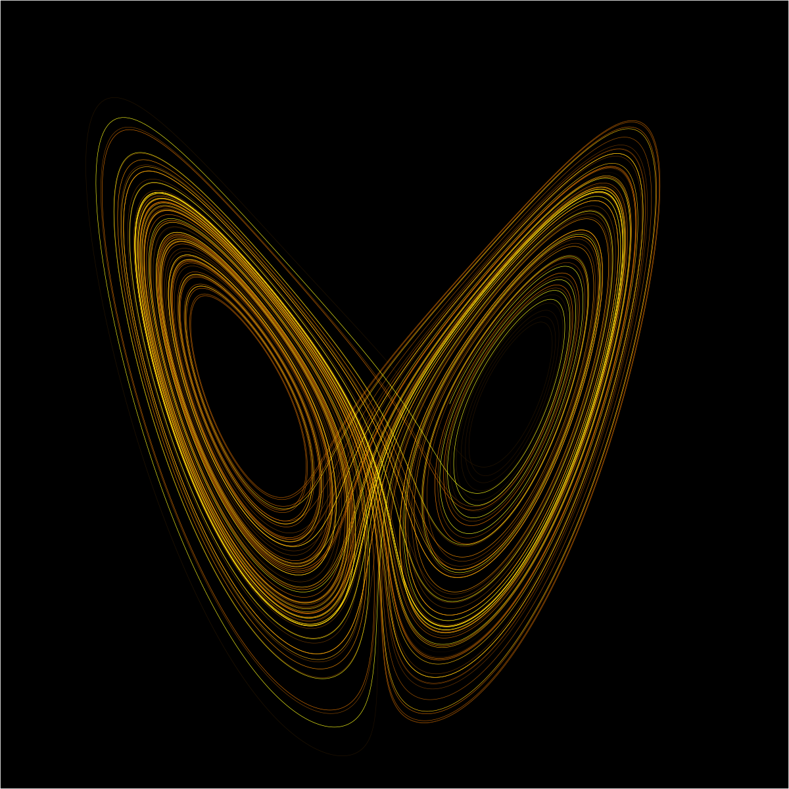

# The Exotic Geometry of Randomness

**Srijit Mukherjee**  
Pennsylvania State University  

## We love chaos. Don't we?

> "The butterfly that flutters its wings and causes a hurricane on the other side of the world." Sound familiar? Are you that butterfly, Martin?

This quote from the film [The Oxford Murders](https://www.imdb.com/title/tt0488604/) tells us how much we fathom chaos. Through the ages, human beings have tried to decipher and bring order to chaos. One such attempt was the discovery of the Lorentz Attractor, which looks like a butterfly's wings, as shown below. You can read more about it [here](https://en.wikipedia.org/wiki/Lorenz_system).

  

    
  

As Henry Adams has said, "Chaos is the law of nature, and Order: the dream of human". When I was scrolling through the pages of the book *Chaos: Making a New Science*, a question popped into my mind this morning "What do random things look like?".

What can be better than rolling dice to start the journey? Take a dice in your hand. Roll it.

    

